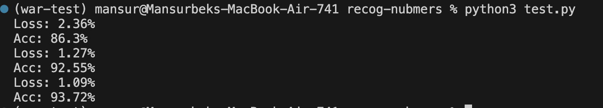
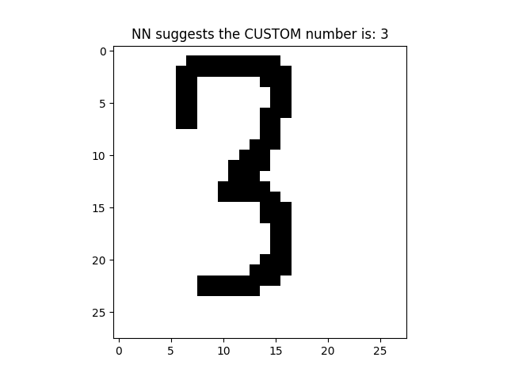
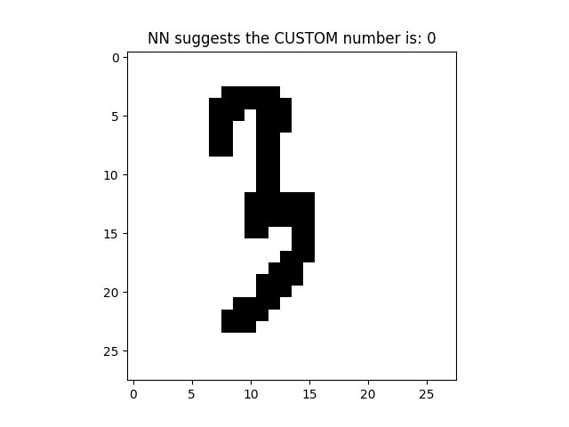

# 🖊️ **DigitRecognizer**

A handcrafted neural network built from scratch using NumPy to classify handwritten digits from the MNIST dataset. Perfect for learning and experimenting with core neural network concepts like forward propagation, backpropagation, and gradient descent.

---

## 🚀 **Features**

✅ **Custom Neural Network**  
A single hidden-layer network with sigmoid activation functions, trained entirely from scratch.  

✅ **MNIST Dataset Integration**  
Seamlessly loads and preprocesses the MNIST dataset for efficient training and testing.  

✅ **Interactive Testing**  
Test the model on MNIST data or your custom handwritten digits (`custom.png`).  

✅ **Training Visualization**  
Monitor the model's performance through loss and accuracy updates after every epoch.  

✅ **Minimal Dependencies**  
Uses only Python, NumPy, and Matplotlib—no heavy frameworks required!  

---

## 📂 **Project Structure**

```plaintext
DigitRecognizer/
│
├── main.py         # Main script for training and testing
├── test.py         # Interactive testing script
├── utils.py        # Utility functions for loading the MNIST dataset
├── mnist.npz       # Preloaded MNIST dataset
├── custom.png      # Custom image for testing
├── tests/
│   ├── test2.png   # Additional test image 1
│   └── test3.png   # Additional test image 2
├── demo/
│   └── demo        # Directory for demo files
├── .gitignore      # Git ignore file for unnecessary files
├── requirements.txt # List of required Python packages
└── README.md       # Repository documentation
```

---

## 🛠️ **Getting Started**

### **1. Clone the Repository**

```bash
git clone https://github.com/MansurPro/DigitRecognizer.git
cd DigitRecognizer
```

### **2. Install Dependencies**

Ensure you have Python installed, then install NumPy and Matplotlib:

```bash
pip install -r requirements.txt
```

### **3. Train the Model**

Run the `main.py` script to train the neural network on the MNIST dataset:

```bash
python main.py
```

### **4. Test the Model**

Use `test.py` to interactively test the model with MNIST data or custom images:

```bash
python test.py
```

---

## 🎨 **Preview**

### Training Visualization:


### Interactive Testing (success):


### Interactive Testing (fail):


---

## 📊 **How It Works**

1. **Input Layer**: Processes 784-pixel flattened grayscale images.  
2. **Hidden Layer**: Applies sigmoid activation for feature extraction.  
3. **Output Layer**: Outputs predictions using sigmoid activation.  
4. **Backpropagation**: Optimizes weights and biases to minimize error using gradient descent.

---

## 🧑‍💻 **Contributions**

We welcome contributions! Feel free to fork this repository, open issues, or submit pull requests.

---

## 📜 **License**

This project is licensed under the MIT License. See the [LICENSE](./LICENSE) file for more details.

---

## 🙌 **Acknowledgments**

Special thanks to the creators of the MNIST dataset and the open-source community for their resources and support.
